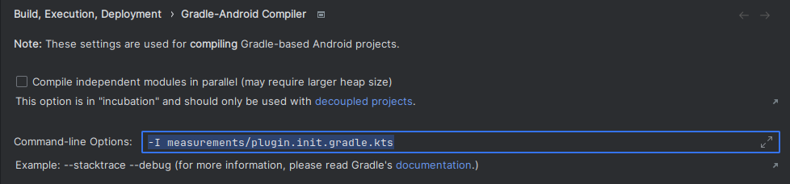

# android-extra-large-benchmark
A very large Android benchmark project, used for profiling build and sync performance. The project is intentially very large in order
to make detecting performance issues easier. The project has been generated using [project-replicator](https://github.com/android/project-replicator),
with a real-world project blueprint file.

# Using the benchmark
Please clone a version-specific branch of the project. E.g. `git clone --branch 2022.9 https://github.com/gavra0/android-extra-large-benchmark.git`. More versions of the project will be added in the future,
and each will follow the same versioning patter `YEAR.MONTH`. To see all available versions run `git branch -r`

# Adding a new version of the benchmark
Use the [project-replicator](https://github.com/android/project-replicator) to generate a new copy of the project.
Follow the steps below:
```
git checkout -b <YEAR.MONTH> && git reset --hard origin/main
# generate the project using project-replicator
git add * # add all our your changes
git commit -m "New version of the project"
git push origin HEAD
```

# Running tasks
The main application is `:module03:module09:module1`, and in order to benchmark it please run
```
./gradlew :module03:module09:module1:assembleDebug
```

You can also execute `./gradlew assembleDebug` that will assemble all projects, but please keep in mind this will take a
while to run.

# Working with smaller subsets
The top level directory contains multiple settings.gradle files which allow
working with smaller subsets of the project for different scenarios. You can set up the project to be a subset with the 
following command:

```
./apply_diff.sh 1000 
```

This will replace the `settings.gradle` file and also set an appropriate max heap for the subset according the map
inside the script.

You can also manually do this by specifying the `-c` or `--settings-file` 
options when invoking gradle. However, this will not include things like setting the max memory for the subset. Example:

```
./gradlew -c settings-200.gradle build
```

# Getting memory measurements 
Included in `measurements/plugin.init.gradle.kts` is a Gradle plugin that can capture histogram, heap,
or timestamps when a sync starts, project configuration finishes and sync finishes.  To enable the 
plugin, from Studio go to Settings -> Build, Execution, Deployment -> Gradle-Android compiler -> 
Command-line options and add `-I measurements/plugin.init.gradle.kts`. This tells studio to run this
script as an init script.

The UI/strings can slightly change across Studio versions, but below is roughly how it should look
like.


There is also an option that essentially tells JVM to not treat soft references any differently than
other references, this makes sure we get more reliable memory readings. It can be enabled via 
following. When this is enabled, the total object size reported by the histogram/heap will be much
more reliable and can be used as an indicator of memory regressions. Without the flag, we'd need 
additional processing of the heap to figure out only the strongly reachable objects.

`./apply_diff.sh <desired_size> --remove-soft-references`

All this does is to add `-XX:SoftRefLRUPolicyMSPerMB=0` to Gradle daemon's JVM args. The flag will 
be removed if `apply_diff.sh` is run without `--remove-soft-references`
